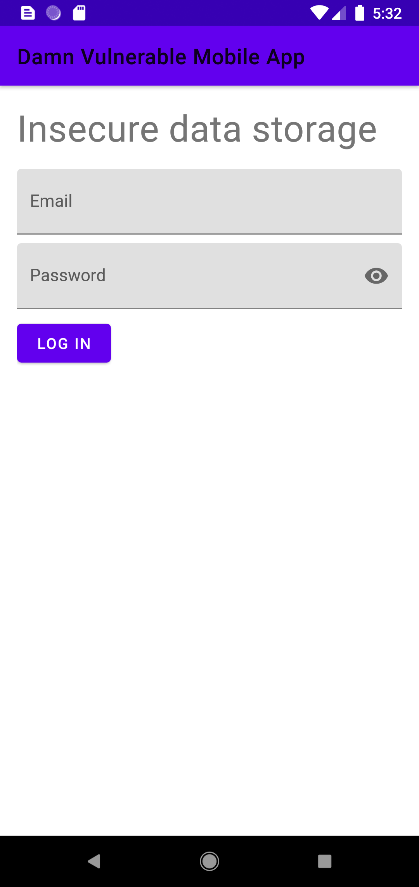

# Damn-Vulnerable-Mobile-App
> An intentionally insecure Android application.

## Table of contents
* [Introduction](#introduction)
* [Screenshots](#screenshots)
* [Features](#features)
* [Status](#status)
* [Contact](#contact)

## Introduction
This project aims to create an intentionally insecure Android app containing the following vulnerabilities:
* Insecure data storage
* Improper platform usage
* Insecure communication
* Insecure data handling
* Poor authentication

## Screenshots

## Features
List of features:
* Insecurely store data!

## Status
Project is: _in progress_

## Contact
Created by [Chris Barker](https://github.com/barkerchris)