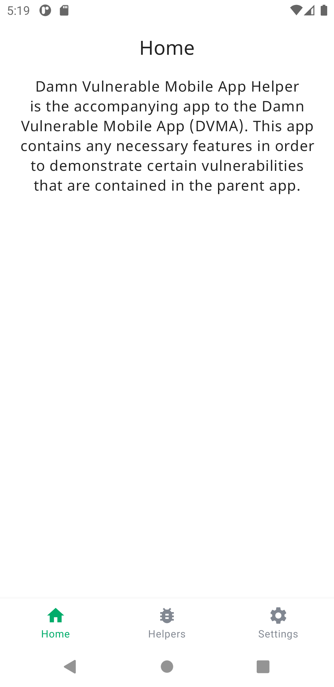
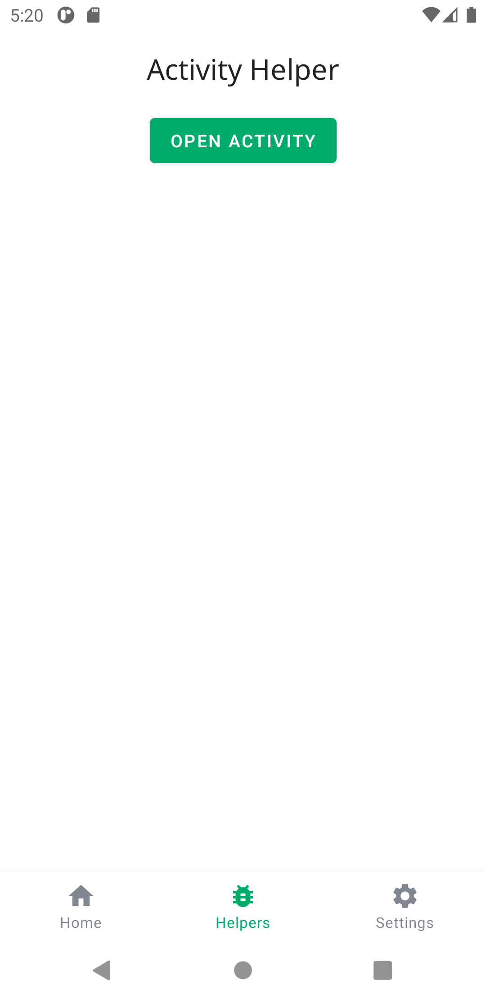
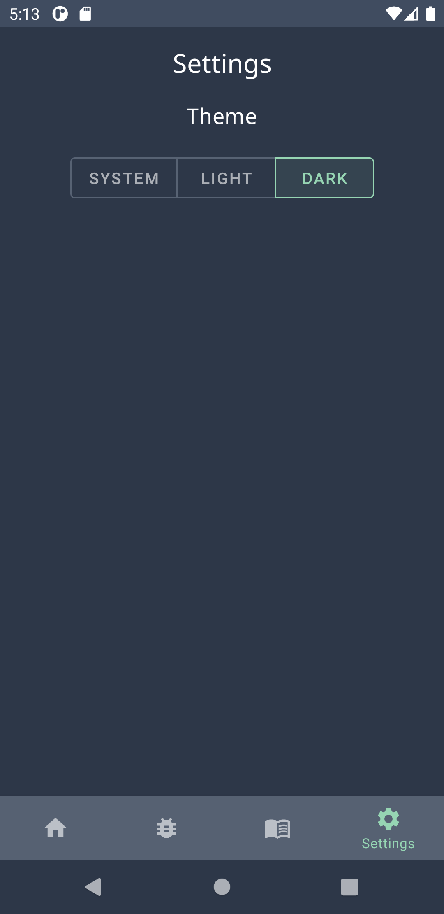

# Damn-Vulnerable-Mobile-App-Helper
> Accompanying app to the DVMA project.

## Table of contents
* [Introduction](#introduction)
* [Features](#features)
* [Screenshots](#screenshots)
* [Status](#status)
* [Contact](#contact)

## Introduction
This project is an accompanying app required to demonstrate certain features part of an intentionally insecure Android app.

## Features
List of features:
* Contains helper features that demonstrate certain vulnerabilities included in the main app
* Light/Dark theme
* Clean interface following Material Design guidelines
* Focus on modern app features such as Jetpack Navigation (1 activity, many fragments approach)

## Screenshots

## Status
Project is: _in progress_

## Contact
Created by [Chris Barker](https://github.com/barkerchris)